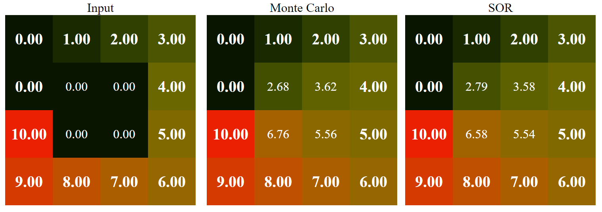

# Laplace Equation Solver



Retrieves temperature information from Arduino and computes (approximate) solution of the Laplace equation problem.

## Prerequisites

- [Rust](https://www.rust-lang.org/tools/install) Nightly 1.57.0 or higher
- [CMake](https://cmake.org/download/) 3.13.0 or higher
- Proper C++ compilers such as GCC, [Clang](https://releases.llvm.org/download.html), or [MSVC](https://visualstudio.microsoft.com/)

## How to build

- Clone this repository

```
git clone https://github.com/paxbun/laplace-eq-therm
```

- Build the entire project using `cargo`

```
cargo build --workspace --release
```

- Move to the directory where the compiled binaries are saved

```
cd target/release
```

## How to run the server

Launch the server by typing the following command:

```
./laplace-eq-therm-server <width of the matrix> <height of the matrix>
```

The server program is using [Rocket](https://github.com/SergioBenitez/Rocket). All configuration parameters supported by Rocket can be set to other values by the users. For detail, please refer [the documentation](https://rocket.rs/v0.4/guide/configuration/). For example, you can change the listening IP address in PowerShell as follows:

```powershell
${env:ROCKET_ADDRESS} = "0.0.0.0";
./laplace-eq-therm-server 3 5
```

or in bash:

```bash
export ROCKET_ADDRESS=0.0.0.0
laplace-eq-therm-server 6 10
```

When the server is launched successfully, you will see a message like:

```
Rocket has launched from http://0.0.0.0:8000
```

Open a web browser and type the URL into the address bar. You must see several tables with colored cells.

## How to set temperature at a point through web browsers

Each point of the input matrix (represented as a cell in the input table) can be in one of three states:

- `Boundary`: This point constitutes the boundary condition.
- `GroundTruth`: This point does not participate in the computation of the solution of the equation. This point is to be compoared with the simulated values.
- `OutOfRange`: This point does not participate in the computation, and its value is not considered valid.

On the website, cells in each state are displayed differently as follows:

- `Boudnary`: Bold, 20px
- `GroundTruth`: Normal, 16px
- `OutOfRange`: Transparent

To toggle between the states, just click the cell you want to change. You will be prompted for the new temperature value of that cell if needed.

## How to connect Arduino to the server

This repo contains another executable, `laplace-eq-therm-client`. This program reads temperature information from your Arduino board and sends it to the server.
To see all available Arduino boards connected to your PC, just type as follows:

```
./laplace-eq-therm-client
```

You will see a message as the following:

```
Usage: laplace-eq-therm-client <X> <Y> <Type> <Arduino Serial port> <Server URL>

<Type> is one of the following:
* B: Boundary point
* I: Internal point (Ground truth)

1 Arduino device found
* COM3
```

As you can see, there is a list of name of serial ports which are bound to Arduino boards in the last section.
Choose one of them, then compile and upload [`Program.ino`](./Program.ino) to that board. After uplaoding, disconnect the board from Arduino's default serial monitor.
Launch the client program following the usage instruction, e.g.:

```
laplace-eq-therm-client 3 10 B COM3 http://localhost:8080
```

Then you will be able to see that the temperature information sent by the client is reflected to the simulation result.

## How to add custom algorithm implementers

The main algorithm implementations reside in the C++ part, not the Rust part. Go to [./server/core/Space.hh](`Space.hh`) and see the definition of `Space`.
`Space` is a class which represents an algorithm implementer. Refer to [./server/core/MockSpace.cc](`MockSpace`) to find out what each virtual function must do.

After implementing your own `Space` class, go to [./server/core/Server.cc](`Server.cc`) and find the function `leth_create`.
The definition of `leth_create` is as shown below:

```cpp
ServerHandle leth_create(uint16_t width, uint16_t height) noexcept
try
{
    return Server::Make<MockSpace>(width, height);
}
catch (...)
{
    return nullptr;
}
```

To add your implementations, just pass your classes to `Server::Make`. Suppose your `Space` classes are `FooSpace`, `BarSpace`, and `BazSpace`.
Add your classes as follows:

```cpp
ServerHandle leth_create(uint16_t width, uint16_t height) noexcept
try
{
    return Server::Make<MockSpace, FooSpace, BarSpace, BazSpace>(width, height);
}
catch (...)
{
    return nullptr;
}
```

The server will automatically run your implementations and emit the results to the clients. Note that `Server::Make` can take any number of classes as parameters.
